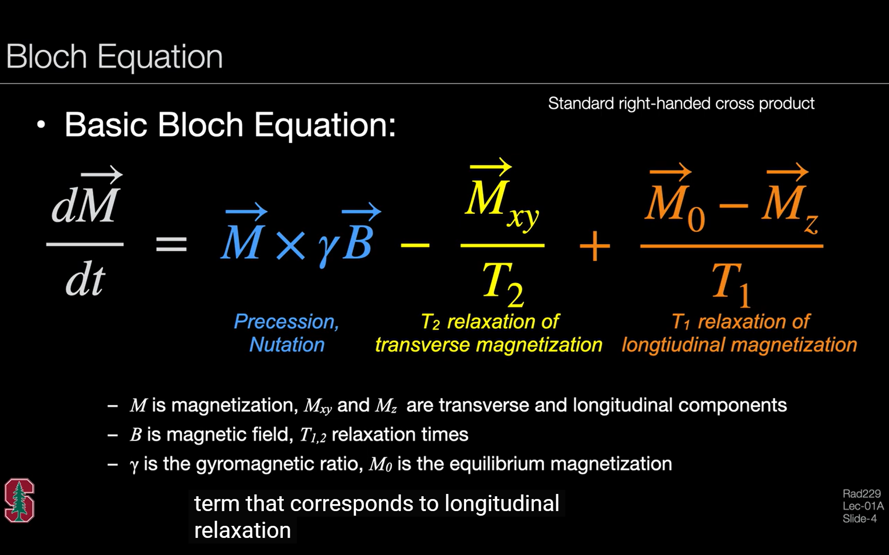
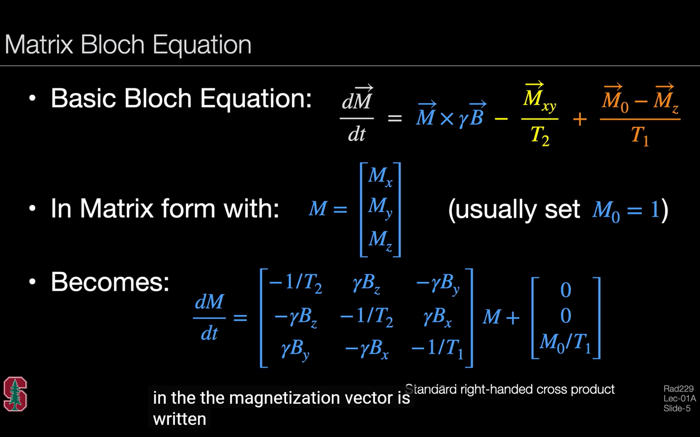

# 1. Basic Bloch Equation

> Thanks very much for the [RAD 229](https://web.stanford.edu/class/rad229/) for providing the slides and basic Matlab functions for this summarized tutorials!

> *In this tutorial series, you'll learn how to use Bloch simulation to model the MR signal by applying various components (e.g., RF pulses, gradients, etc.). This forms the foundation of MR imaging and MRS, providing insight into how the signal is generated and evolves.*

The standard bloch equation:

In the following sections, we use the matrix form of the equation to simplify calculations, especially when using MATLAB.

