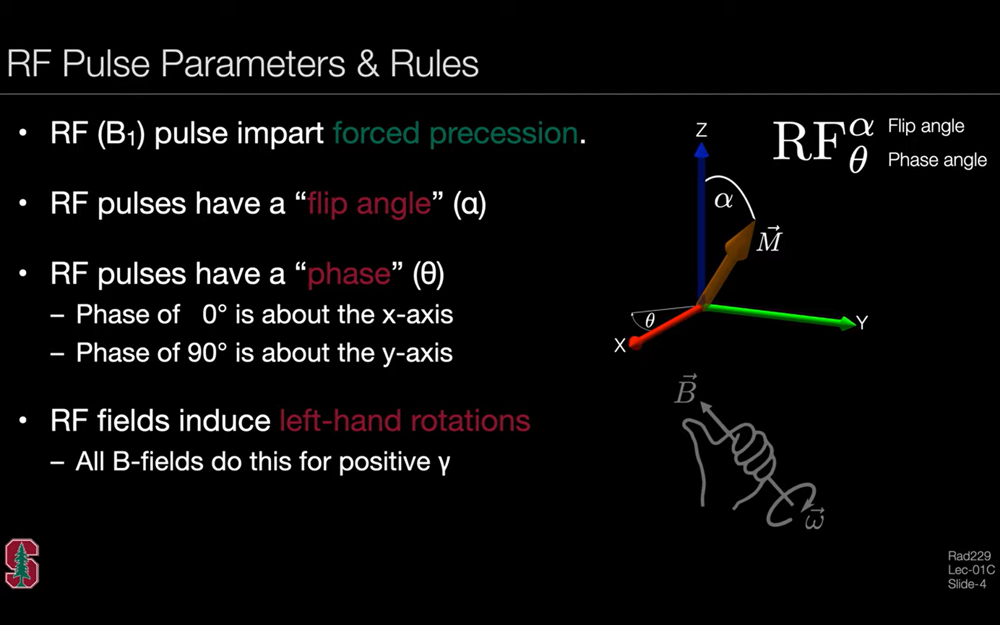
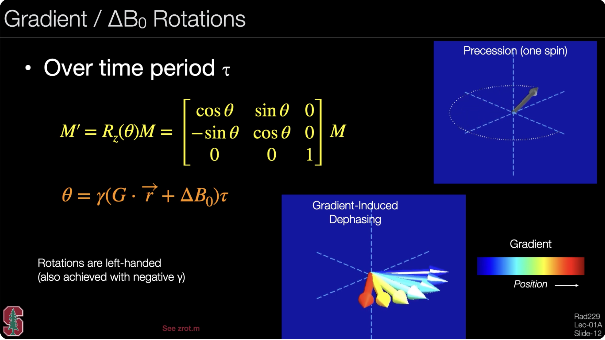

# 2. Bloch Simulation (Components)

All embedded code could be found in: [ZN_branch modified based on MRSignalSeqs](https://github.com/ZihanNing/MRSignalsSeqs/tree/ZN_testing/Zihan_summary/Bloch_simulation)

> **Summarized list**  
> - Relaxation: [relax.m](https://github.com/ZihanNing/MRSignalsSeqs/blob/ZN_testing/Zihan_summary/Bloch_simulation/relax.m)  
> - RF Rotation (B1 along positive x-axis): [xrot.m](https://github.com/ZihanNing/MRSignalsSeqs/blob/ZN_testing/Zihan_summary/Bloch_simulation/xrot.m)  
> - RF Rotation (B1 along positive y-axis): [yrot.m](https://github.com/ZihanNing/MRSignalsSeqs/blob/ZN_testing/Zihan_summary/Bloch_simulation/yrot.m)  
> - RF Rotation (flexible B1): [throt.m](https://github.com/ZihanNing/MRSignalsSeqs/blob/ZN_testing/Zihan_summary/Bloch_simulation/throt.m)  
> - Gradient Rotation: [zrot.m](https://github.com/ZihanNing/MRSignalsSeqs/blob/ZN_testing/Zihan_summary/Bloch_simulation/zrot.m)  


## 2.1 Relaxation

refer to: [relaxation bloch function](https://github.com/ZihanNing/MRSignalsSeqs/blob/ZN_testing/Zihan_summary/Bloch_simulation/relax.m)

## 2.2 RF Rotation 

> Given the flip angle \\(\alpha\\) and phase \\(\theta\\) (the angle between B1 direction and positive x-axis) of the RF pulse  
> *To note: the flip obeys the left-handed rule*  


**Here, we expect the B1 field only applied on the xy-plane. For any imperfections (components on z direction), taking it as 'Gradient Rotation' (see below 2.3)**

Three functions for RF rotation simulation:  

- xrot: B1 along the positive x-axis (\\(\theta = 0^o\\)), for xrot(90), the M will be flipped to positive y-axis (left-handed rule) [xrot function](https://github.com/ZihanNing/MRSignalsSeqs/blob/ZN_testing/Zihan_summary/Bloch_simulation/xrot.m)
- yrot: B1 along the positive y-axis (\\(\theta = 90^o\\)), for yrot(90), the M will be flipped to negative x-axis (left-handed rule) [yrot function](https://github.com/ZihanNing/MRSignalsSeqs/blob/ZN_testing/Zihan_summary/Bloch_simulation/yrot.m)

- throt: for B1 with flexible directions on xy-plane [throt function](https://github.com/ZihanNing/MRSignalsSeqs/blob/ZN_testing/Zihan_summary/Bloch_simulation/throt.m)
    
    > xrot and yrot are special cases of throt (\\(\theta = 0^o\\) and \\(90^o\\)), respectively

    

## 2.3 Gradient Rotation

There are three ways to cause the gradient rotation:

1. Add gradient \\(G\\)
2. B0 field inhomogeneity \\(\Delta B_0\\)
3. B1 field imperfection (off-resonance) \\(\Delta \omega = \omega_{RF} - \omega_0\\)

> To note: the phase difference caused by the gradient \\(G\\) is: \\(\phi_G(r) = -\gamma \int^\tau_0 G(r,t)r dt\\)  
> Especially, for the linear gradient: \\(\phi_G(r) = -\gamma G* \tau * r\\)

Therefore, the overall gradient rotation (phase) angle is: \\(\theta = (\gamma G* r+\gamma \Delta B_0 + \Delta \omega)\tau\\)

Actually, this phase difference is called the 'angle', since it is the angle between the actual rotating frequency to the rotating frame based on \\(\omega_0 = \gamma B_0\\), which means the new/actual rotating frame rotate faster/slower: \\(\omega_{new} = \omega_0+\frac{\theta}{\tau}\\)

 (see [zrot function](https://github.com/ZihanNing/MRSignalsSeqs/blob/ZN_testing/Zihan_summary/Bloch_simulation/zrot.m))

## 2.4 Perfect Spoiler

A perfect spoiler refers to a result that can be achieved through various methods (e.g., RF spoiling or gradient spoiling), all leading to the same outcome: complete elimination of transverse magnetization.

> **Gradient Spoiler**: To achieve complete spoiling, the phase difference between different positions \\(r\\) must exceed \\(2\pi\\) (i.e., \\(\phi(r) = \gamma G r \tau >> 2\pi\\)), so that the transverse magnetization vectors \\(M_{xy}(r)\\) at different locations cancel each other out, resulting in a net transverse magnetization of zero.  
> **RF Spoiler**: This technique is commonly used in SPGR (T1-FLASH) sequences.
It involves varying the phase of each excitation RF pulse in the GRE sequence (RF phase cycling) so that the transverse magnetization vector \\(M_{xy}(r)\\) within each TR (\\(TR_n\\)) accumulates to zero. To achieve effective spoiling, the phase difference between consecutive RF pulses is typically set to 117°, 137°, or 111.246°.

However, as mentioned, whatever which method has been applied, the simulation of the perfect spoiler is the same: to set the \\(M_x\\) and \\(M_y\\) all as 0. 

```
M(1:2,:)=0;				% Perfect spoiler
```


## 2.5 Propagation

When multiple components (e.g., gradient rotation, relaxation, etc.) are applied over time, their combined effect can be represented by a single computation matrix applied to \\(M\\) all at once. This process is referred to as **propagation**.

### 3x3 matrix propagation

With this settings:

- net magnetization: \\(M=[M_x, M_y, M_z]\\)  
- A is a 3x3 matrix, which could represent the changes inducted by RF rotation, gradient rotation, T2 relaxation, and part of T1 relaxation  
- B is a 1x3 matrix, which only included the changes caused by part of T1 relaxation


Then the principle of propagation is: 


### 4x4 matrix propagation

To simplify the propagation, matrices A and B can be combined into a single 4×4 matrix, allowing the propagation to be performed with a single matrix multiplication.

. 
> There's a mistake within this pic: the B matrix should be \\(B_{1x3}\\) instead of \\(B_{3x3}\\)

For Matlab compuatation, see [abprop.m](https://github.com/ZihanNing/MRSignalsSeqs/blob/ZN_testing/Zihan_summary/Bloch_simulation/abprop.m)


### Order of propagation

When different components are applied over time, **those applied earlier are closer to \\(M_0\\) in the computation sequence**.  
However, the order of applying relaxation and gradient rotation matrices can be reversed without affecting the result, whereas RF rotation cannot be interchanged with any other computation matrix:
\\(\text{xrot} \times \text{relaxation} \ne \text{relaxation} \times \text{xrot}\\).

This leads to a tricky case: what happens when RF rotation, gradient rotation, and relaxation occur simultaneously? For example, during slice-selective excitation. (For details, see Section 3, Case D.)


## 2.6 Complex Representation

Sometimes, for easier representation of phase and magnitude, we turn real representation of magnetization into complex form:  
- **Real**: \\(M = [M_x, M_y, M_z]\\)  
- **Complex**: \\(M = [M_{xy}, M_{xy}^*, M_z]\\), in which \\(M_{xy} = M_x + iM_y\\)

Therefore, the translation between this **real \\(M_r\\)** and **complex \\(M_c\\)** form is (refer to [mr2mc](https://github.com/ZihanNing/MRSignalsSeqs/blob/ZN_testing/Zihan_summary/Bloch_simulation/mr2mc.m) and [mc2mr](https://github.com/ZihanNing/MRSignalsSeqs/blob/ZN_testing/Zihan_summary/Bloch_simulation/mc2mr.m)):


